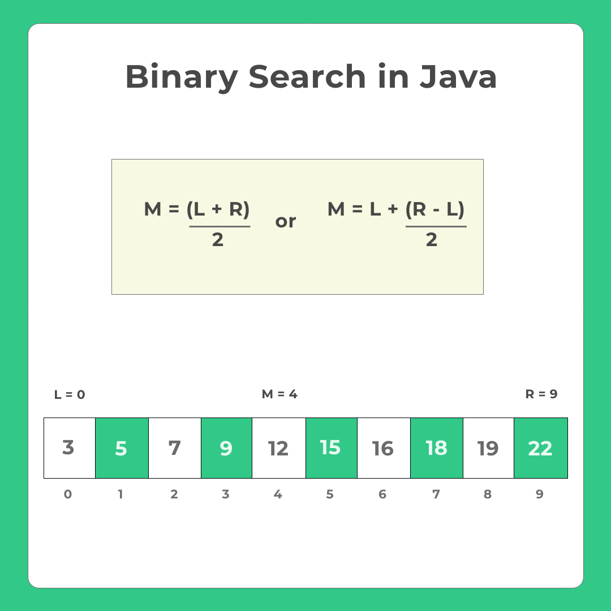
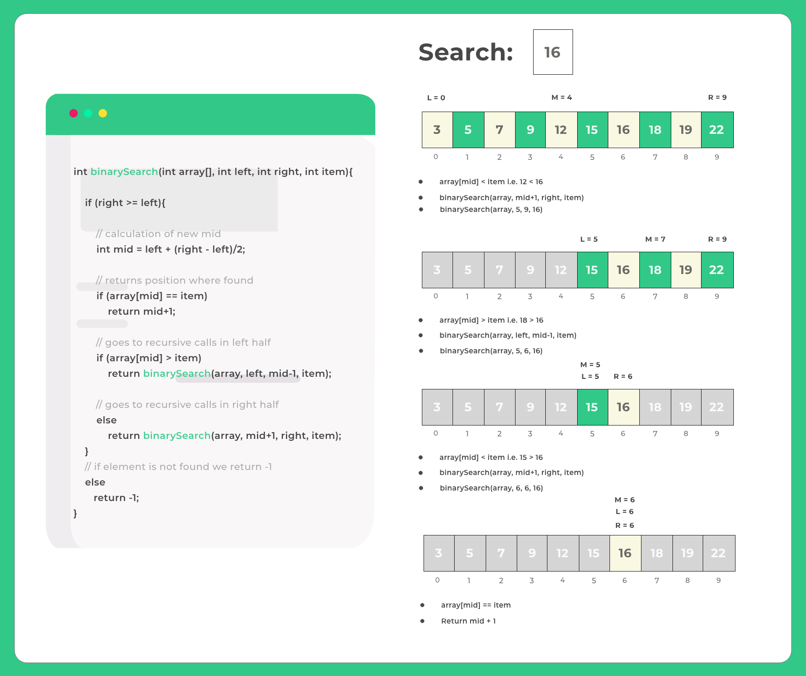

# Binary Search

- Binary search is a search algorithm that finds the position of a target value within a sorted array. It compares the target value to the middle element of the array. If they are not equal, the half in which the target cannot lie is eliminated and the search continues on the remaining half, again taking the middle element to compare to the target value, and repeating this until the target value is found. If the search ends with the remaining half being empty, the target is not in the array.

- Binary search works on the principle of divide and conquer. It repeatedly divides the search space in half until the target value is found or there is no more search space left. This logarithmic behavior gives binary search its efficient time complexity.

| Time Complexity |          |
| --------------- | -------- |
| Best            | Ω(1)     |
| Avg             | Θ(log n) |
| Worst           | O(log n) |

| Space Complexity | O(1) |
| ---------------- | ---- |

# Working of binary search

- For Binary Search to be performed on any array, the array must be already sorted in any format, that is, either ascending or descending.
- Find the middle index of the array/list.
- If the middle element is equal to the search element, Stop Searching.
- If the element that is to be searched is less then the middle element then consider the first half as a separate list.
- Else-If the element that is to be searched is larger then the middle element then consider the second half as a separate list.
- Repeat Step 2-3-4-5 Until desired result is found.

