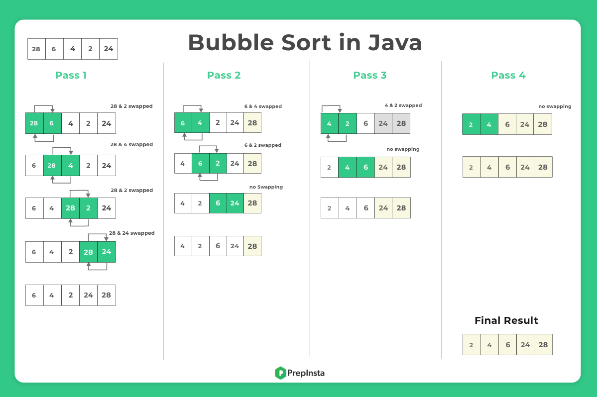

# Bubble Sort

- Bubble Sort is the elementary sorting algorithm for sorting various data structures. It is a comparison-based sorting algorithm in which each element is compared with the next element, and is swapped if those elements are not in the correct order.

- The algorithm starts with comparing the first pair of elements.
- If the first element is smaller than the second element, then the elements are swapped
- This algorithm is not suitable for large data sets

| Time Complexity  | O(n^2)   |
| ---------------- | -------- |
| Best Case        | O(n)     |
| Worst Case       | O(n^2)   |
| Space Complexity | O(1)     |
| Avg Comparisons  | n(n-1)/2 |

- Step 1: Start from the first element of the array, compare the current element with the next element of the array.
- Step 2: If the current element is greater than the next element of the array, swap them. If the current element is less than the next element, move to the next element.
- Step 3: Repeat Step 1 and Step 2 until the array is sorted. In other words, repeat Step 1 and Step 2 for n times where n is the length of the array 

